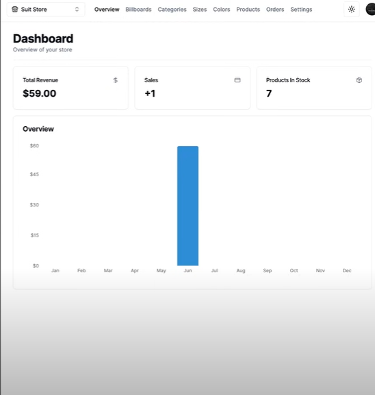
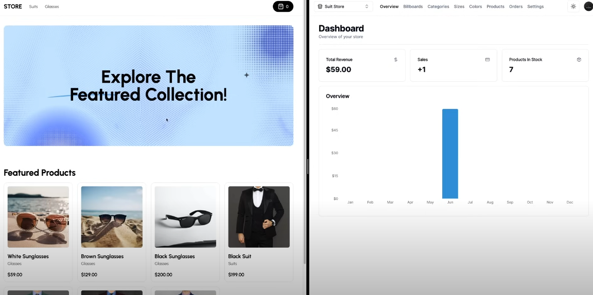
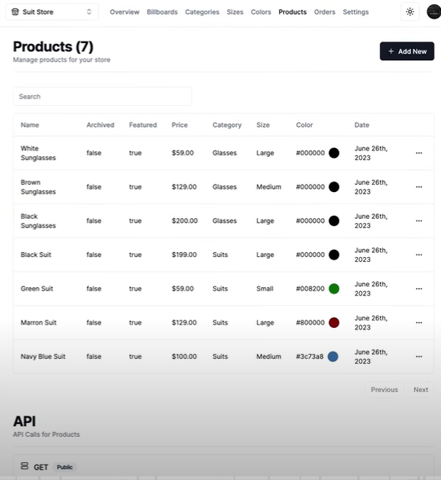
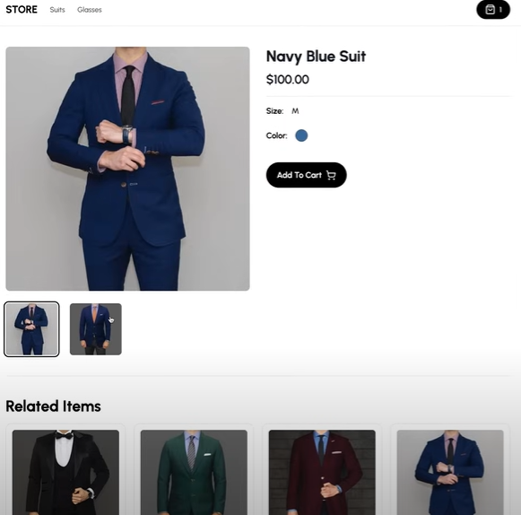
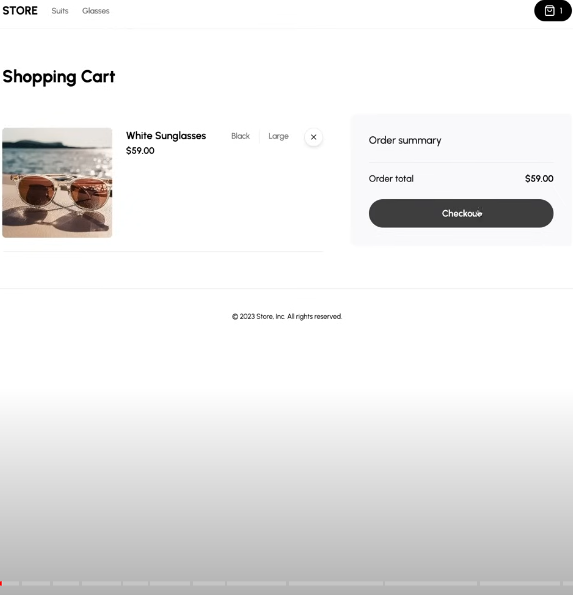
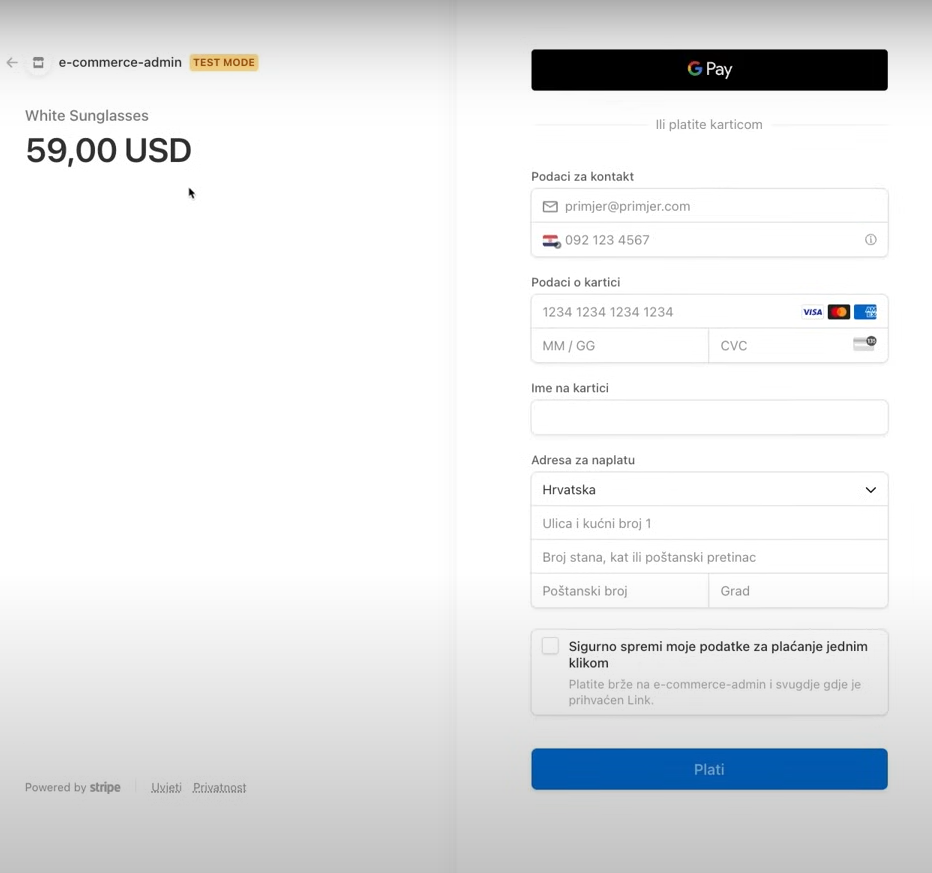
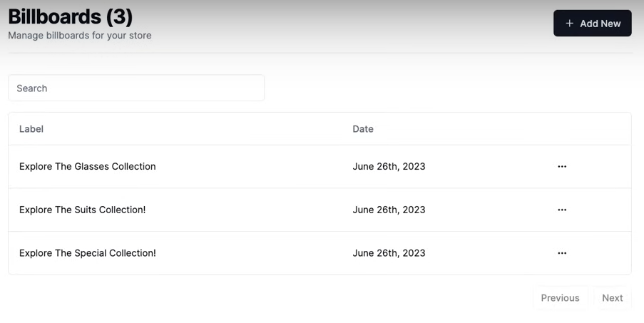
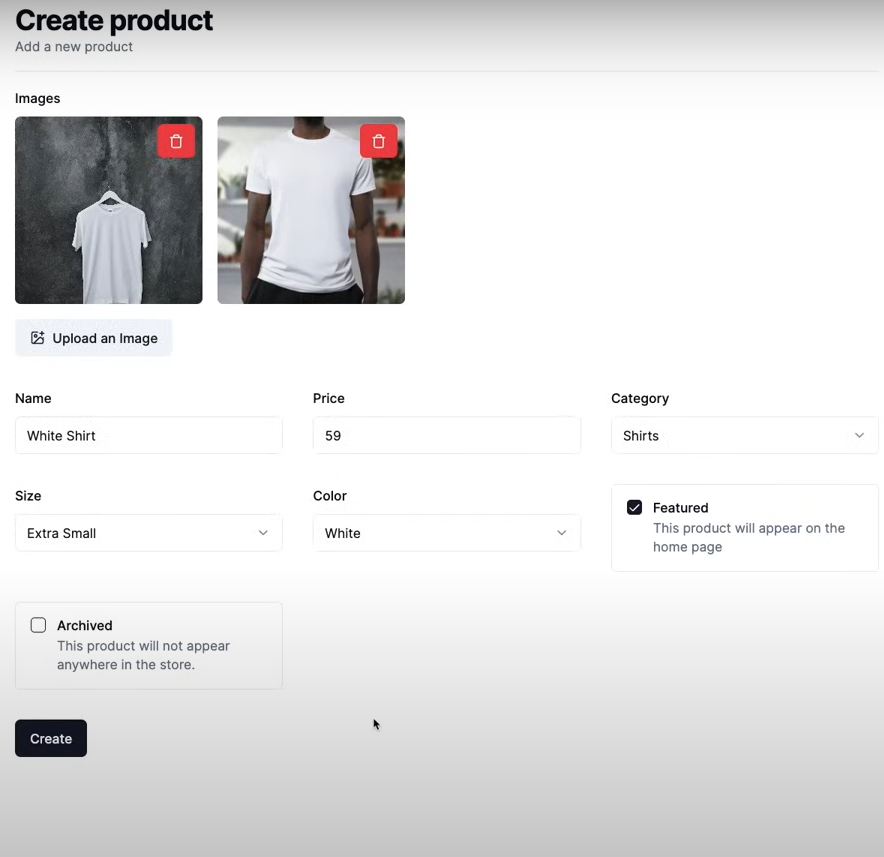

# E-Commerce Store admin

## Overview

A Next.js e-commerce website featuring modern UI components and smooth user experience. The project leverages Tailwind CSS for styling and Zustand for state management.

## Features

- Product Listings
- User Authentication
- Shopping Cart
- Product Filtering and Sorting
- Responsive Design
- Checkout Process
- Order History
- User Profile Management
- Admin Dashboard
- Real-time Notifications

## Technologies

- **Frontend:** Next.js, Tailwind CSS, Zustand
- **Utilities:** Axios, clsx, lucide-react, react-hot-toast
- **Development Tools:** ESLint, TypeScript, PostCSS, Autoprefixer

## Project Screenshots

Here are some screenshots of the project:












## Installation

1. **Clone the Repository**

   ```bash
   git clone https://github.com/abressiddique/ecommerce-store.git
